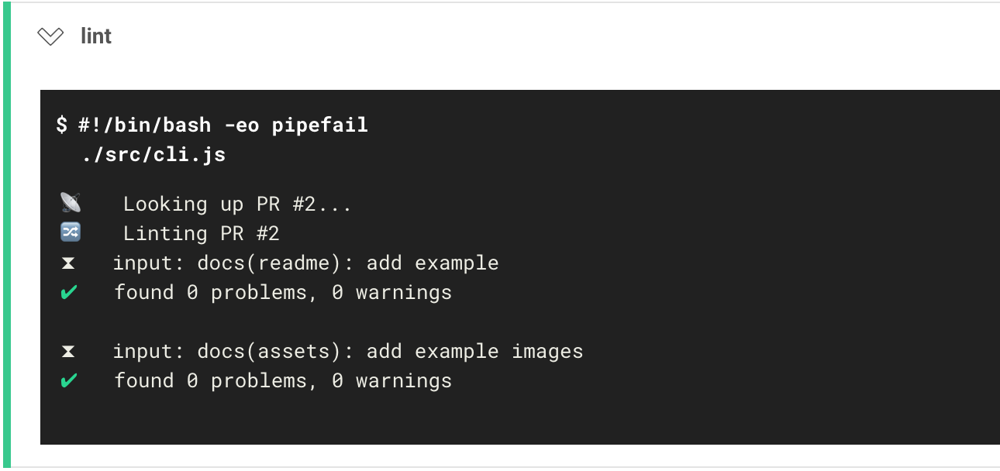
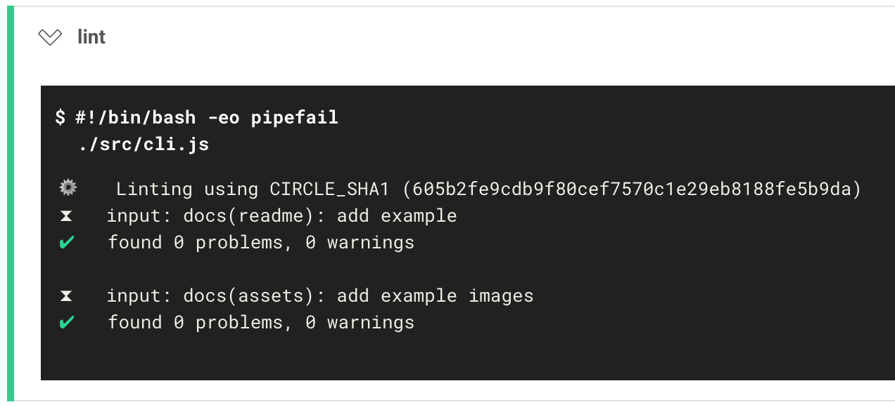

> Lint all relevant commits for a change or PR on Circle CI

# commitlint-circle

This package is a convenience wrapper around `commitlint`, 
providing zero-configuration linting of all relevant commits
for a given change/build combination.

## Getting started

```
yarn add commitlint-circle --dev
```

```yml
# .circleci/config.yml
- run: yarn commitlint-circle
```

## Screenshot

##### When building a PR



##### When building a change


